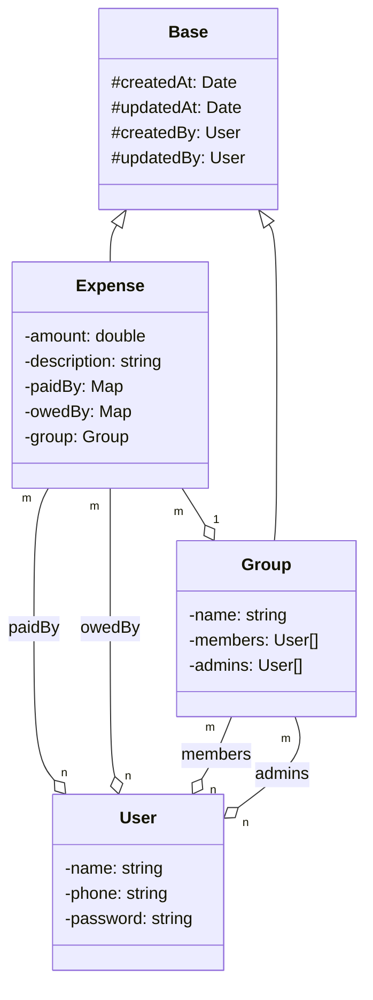
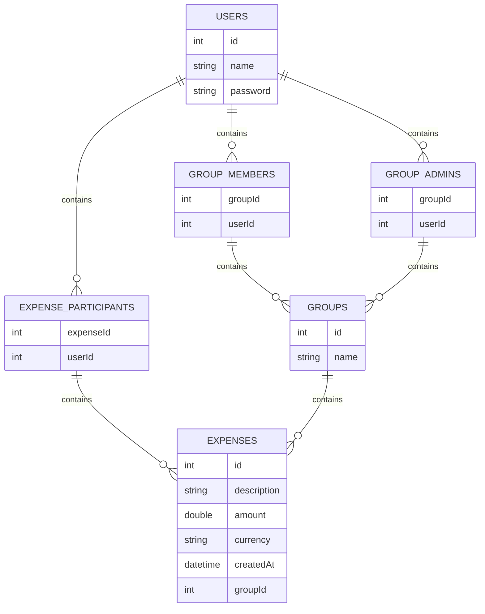
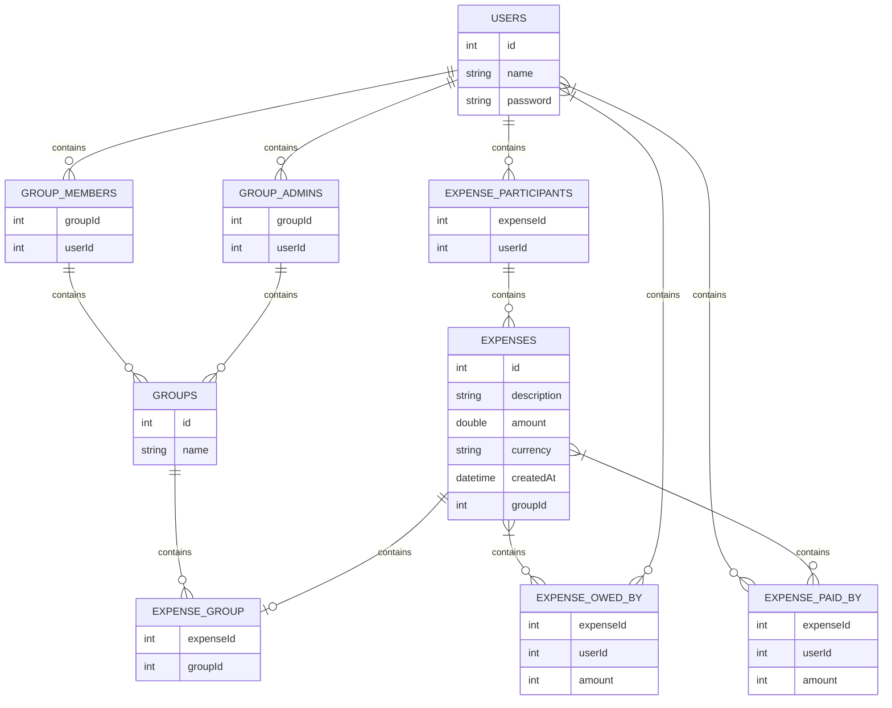
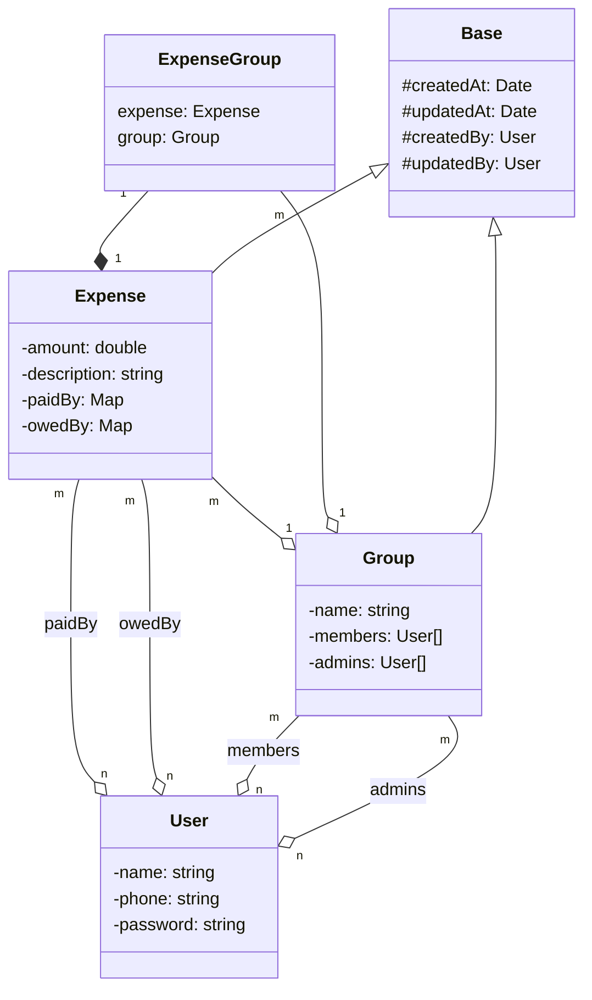

## Expense management system

### Requirements

- Users can register and update their profiles.
- A user's profile should contain at least their name, phone number and password
- Users can participate in expenses with other users
- Users can participate in groups.
- To add an expense, a user must specify either the group, or the other users involved in the expense, along with who paid
  what and who owes what. They must also specify a description for the expense.
- A user can see their total owed amount
- A user can see a history of the expenses they're involved in
- A user can see a history of the expenses made in a group that they're participating in
- Users shouldn't be able to query about groups they are not a member of
- Only the user who has created a group can add/remove members to the group
- Users can request a settle-up. The application should show a list of transactions, which when executed will ensure that
  the user no longer owes or recieves money from any other user. Note that this need not settle-up any other users.
- Users can request a settle-up for any group they're participating in. The application should show a list of transactions,
  which if executed, will ensure that everyone participating in the group is settled up (owes a net of 0 Rs). Note that will
  only deal with the expenses made inside that group. Expenses outside the group need not be settled.
  Good to Have Requirements
- When settling a group, we should try to minimize the number of transactions that the group members should make to
  settle up.

Note: All tests will be performed in one go. The application doesn't need to persist data between runs.

### Learnings

- Relational databases don't work well with files so files should not be saved in database
- Schema diagram is not as same as class diagram, we need to look at cardanality 
- In case of m:1 or 1:m if we end up having a sparse column in table , create a seprate mapping table to save space

### class diagram

Entities : user, expense, group

### Schema diagram

issue: 
- As the ssyetm can also have adhoc expenses that is expenses without group. In that case groupId will become a sparse column and will end up eating more space that required

Solution: 

- To have a different mapping table for expense and groupid

- As we have seprated out group_expense
There will be slight changes in class diagram also

